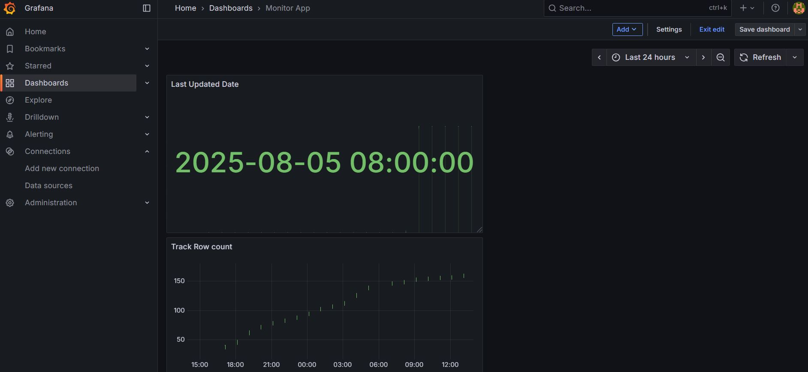

# An extension of `batch-processing-bbc` project

This project integrates infrastructure provisioning and CI/CD deployment pipeline using Terraform and Github Actions to `batch-processing-bbc` project

#### Project Structure and Context

- Main App Repo: `batch-processing-bbc`
    - Automates the extraction, processing, and visualization of BBC news headlines
- Infrastructure Repo: `batch-processing-bbc-infra` (this repository)
    - Provisions AWS infrastructure and automates deployment using Terraform + GitHub Actions
    - Incorporates Grafana and Prometheus to track application health and metrics 

#### Infrastructure as Code (Terraform)

- Provision an AWS EC2 instance with packages like Git, Docker, Docker Compose installed through Terraform
- Promotes repeatable and version-controlled infrastructure provisioning

#### CI/CD Deployment Pipeline (Github Actions)

This includes a two-stage Github Actions workflow 
- Terraform job
    - Configures the AWS credentials
    - Automatically plan and apply Terraform setup and run the Terraform
    - Extracts the EC2 public ip to the deployment job
- Deployment job
    - Automates the deployment of Docker containers to an AWS EC2 instance
    - This mirrors the deployment process defined in the `batch-processing-bbc repo`

#### Track Application Health and Metrics (Grafana and Prometheus)

- Prometheus scrapes custom metrics from PostgreSQL via postgres-exporter to monitor application health, such as:
    - Last updated date of the table
    - Total row count in the table
- Grafana visualises the metrics information through dashboards for easy monitoring. It also supports alerting rules for data staleness or anomalies if required

#### Running the project
- Configure the following Github secrets to automate deployment to AWS EC2

| Name                    | Description                                         |
|-------------------------|-----------------------------------------------------|
| `DOCKER_USER`           | Docker Hub username                                 |
| `DOCKER_PASSWORD`       | Docker Hub password or access token                 |
| `AWS_ACCESS_KEY_ID`     | AWS access key for Terraform access                 |
| `AWS_SECRET_ACCESS_KEY` | AWS secret access key for Terraform access          |
| `AWS_SSH_KEY_PRIVATE`   | Base64-encoded private SSH key for EC2 access       |

- To view the dashboard, go to ```http://<your-ec2-public-ip>:8501```


- To view the Grafana dashboard, go to ```http://<your-ec2-public-ip>:3000```



#### Reference
- https://medium.com/israeli-tech-radar/use-github-actions-and-terraform-to-provision-ec2-instance-5b51636e4e54
- https://docs.github.com/en/actions/how-tos/write-workflows/choose-what-workflows-do/pass-job-outputs
- https://grafana.com/docs/grafana-cloud/send-data/metrics/metrics-prometheus/prometheus-config-examples/docker-compose-linux/
- https://grafana.com/docs/grafana/latest/setup-grafana/installation/docker/
- https://dev.to/nelsonmendezz_/how-to-monitor-posgresql-with-prometheus-and-grafana-docker-24c8


